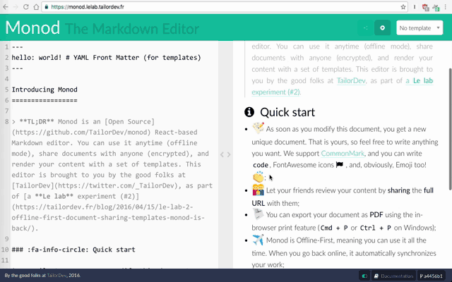

Monod
=====

---

## Hi! I'm Monod, the Markdown Editor!

**Monod** is a (relatively) **secure** and **offline-first** Markdown editor we
have built at TailorDev in order to learn
[React.js](https://facebook.github.io/react/) (and a bunch of other JavaScript
tools and libraries). We dedicated two **Le lab** sessions to build the
foundations of Monod:

* [Introducing Le lab with “Monod”, our Markdown
  Editor](https://tailordev.fr/blog/2016/03/11/introducing-le-lab-with-monod-our-markdown-editor/)
* [Le lab #2 — Offline-First, Document Sharing, Templates: Monod is Back (not in
  Black)](https://tailordev.fr/blog/2016/04/15/le-lab-2-offline-first-document-sharing-templates-monod-is-back/)

---

## Usage

Either use our public instance at: https://monod.lelab.tailordev.fr/, or
self-host Monod at home, on your server, or even on Heroku:

## Documentation

Documentation can be found in the [`doc/`](doc/writing.md) directory.

## Installation

### Production

    $ git clone https://github.com/TailorDev/monod.git
    $ npm install # will run `npm run build`
    $ npm prune --production

We use this
[Dockerfile](https://github.com/TailorDev/dockerfiles/blob/master/node/Dockerfile)
to run Monod in production (which runs `npm run start` from the Monod root
directory).

### Development

    $ git clone https://github.com/TailorDev/monod.git
    $ npm install
    $ npm run dev

The last command runs the development server at
[`http://localhost:8080`](http://127.0.0.1:8080), and uses Hot Module
Replacement. You can override the default host and port through the env
variables `HOST` and `PORT`.

You can also start the server by running:

    $ MONOD_DATA_DIR=/path/to/data npm run start

`MONOD_DATA_DIR` is an environment variable that configures where the server
reads and writes Monod's data. It defaults to `./data/` (so be sure
to create that directory if you start the server with just `npm run start`).

You are all set!

### Other Commands

#### `npm run build`

Builds the client-side application in `build/` (production ready)

#### `npm run stats`

Webpack build + generate a JSON file with metrics. [We blogged about why this
can be useful](https://tailordev.fr/blog/2016/03/17/loading-dependencies-asynchronously-in-react-components/).

#### `npm run lint`

Runs [ESLint](http://eslint.org/).

#### `npm run lint:fix`

Fix all ESLint problems.

## Requirements

We use `node` 5.8+ and `npm` 3.7+.

## Contributing

Please, see the [CONTRIBUTING](CONTRIBUTING.md) file.

## Running the Tests

    $ npm run test

You can also "watch" them:

    $ npm run test:watch

Code coverage is available by running:

    $ npm run cov

## Contributor Code of Conduct

Please note that this project is released with a [Contributor Code of
Conduct](http://contributor-covenant.org/). By participating in this project you
agree to abide by its terms. See [CODE_OF_CONDUCT](CODE_OF_CONDUCT.md) file.

## License

Monod is released under the MIT License. See the bundled [LICENSE](LICENSE.md)
file for details.
