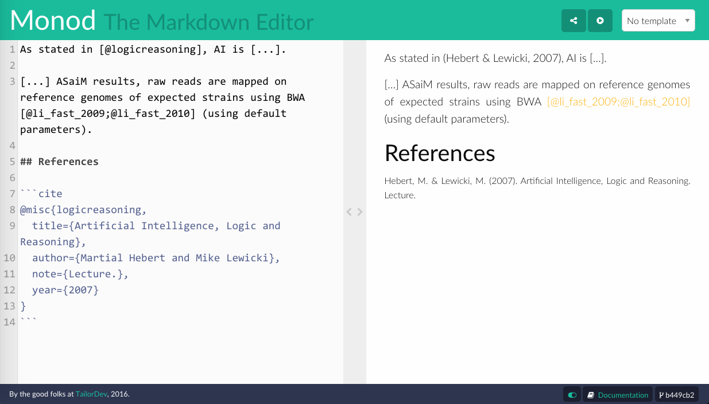
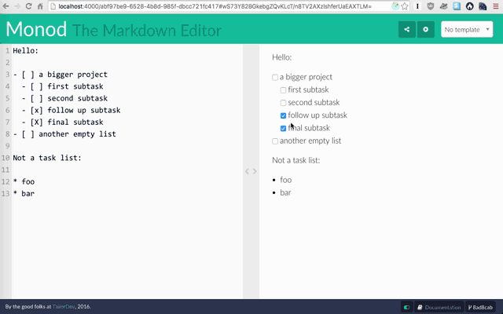

Writing Monod documents
=======================

Hi! Thanks for reading the Monod documentation. Here you will learn how to write
awesome Monod documents by leveraging [Markdown](http://commonmark.org/help/), a
plain text syntax used to layout content without the clutter of too many
formatting instructions.

* [Monod syntax](#monod-syntax)
* [YAML Front Matter](#yaml-front-matter)
* [Templates](templates.md)


## Monod syntax

If you are new to Markdown, you should follow [this 10-minute Markdown
tutorial](http://commonmark.org/help/tutorial/). Monod supports CommonMark (a
strongly defined, highly compatible specification of Markdown). While CommonMark
does not support HTML for security reasons, Monod provides various syntax
extensions to provide HTML-like functionality (and more!).

* [Abbreviations](#abbreviations)
* [Autolinks](#autolinks)
* [BibTeX support](#bibtex-support)
* [Code](#code)
* [Emoji](#emoji)
* [highlighting](#highlighting)
* [Icons / FontAwesome](#icons--fontawesome)
* [Insertions](#insertions)
* [Line break](#line-break)
* [Mathematical expressions](#mathematical-expressions)
* [Small paragraphs](#small-paragraphs)
* [Strikethrough](#strikethrough)
* [Subscript](#subscript)
* [Superscript](#superscript)
* [Tables](#tables)
* [Task lists](#task-lists)


### Abbreviations

The abbreviations syntax extension allows you to provide a description for an
abbreviation or acronym, similar to the
[`<abbr>` HTML tag](https://developer.mozilla.org/en-US/docs/Web/HTML/Element/abbr):

```
*[USA]: United States of America

Some content where USA is mentioned.
```

Note: there is no space between the `*` and the `[` when defining an
abbreviation.

### Autolinks

In regular Markdown, links are usually written with the `[link
description](url)` syntax. In Monod, you can directly paste a URL into your
document, and it will automatically be converted into a clickable link.

### Code

Code can be rendered with fenced code blocks (three backticks). For example:

    A Go interface looks like this:

    ```
    interface {}
    ```

### BibTeX support

Using fenced code blocks (see [the previous section](#code)), you can add
scientific references and citations to your documents and Monod will render them
nicely:



Add citations by adding the keyword `cite` after your fenced code block (see
example below). You can add as many `cite` fenced code blocks as you like, and
then use Pandoc `[@citation_ref]` syntax to add references to these citations
(using the citation "keys" or "references"):

    According to [@citation_ref], this is not accurate.

    ``` cite
    @article{citation_ref,
        ...
    }
    ```

In the screenshot above, the `[@logicreasoning]` reference points to the
citation in the fenced `cite` code block at the bottom of the document. Something
to note here, however, is that while you can add multiple `cite` blocks anywhere
in the document, they will be rendered in the preview in the same place you
have placed them in your document. It is recommended to place all of them in one
single `cite` code block (as you probably do in your `.bib` file anyway).

In the screenshot the `[@li_fast_2009;@li_fast_2010]` reference contains two
references and is marked as invalid because Monod can not find a citation that
corresponds to any of the given references. An important point to note here is
that even if one reference is not found the whole set of references will be
marked as invalid.

### Emoji

We support **emoji** too! :tada:

The syntax is similar to FontAwesome icons (as well as many emoji-friendly
applications like Slack or GitHub), whereby you insert an emoji code between two
colons. For example:

```
:tada:
```

You can find the emoji code for your favorite emoji on
[this cheat sheet](http://www.emoji-cheat-sheet.com/).

### Highlighting

You can highlight text in yellow (like a [Stabilo Boss
Highlighter](https://en.wikipedia.org/wiki/Schwan-Stabilo)) by surrounding your
content with `==`:

```
This is ==very important==
```

### Icons / FontAwesome

You can use [FontAwesome](http://fontawesome.io/) icons with the following
syntax, where `<icon name>` is replaced with an actual icon name (_e.g._,
`check`):

```
:fa-<icon name>:
```

For icon names refer to [this page](http://fontawesome.io/icons/). These are
scalable icons which will be rendered nicely irrespective of the size icon you
use.

### Insertions

Insertions into a document can be highlighted in green by surrounding them with
`++`:

```
Hello. ++I have added this part++
```

### Line break

You can force line breaks in text (carriage returns) using `<br>`, the
[HTML element _line
break_](https://developer.mozilla.org/en-US/docs/Web/HTML/Element/br).

### Mathematical expressions

Thanks to [KaTeX](https://khan.github.io/KaTeX/), Monod supports mathematical
expressions. Write LaTeX symbols enclosed within `$` symbols:

```
An LTS is a 4-tuple $<Q,L,T,q_0>$.
```

### Small paragraphs

It is possible to display content in a smaller font by using the following
syntax:

```
::: small
This content is smaller than the content in the rest of the document.
:::
```

### Strikethrough

You can strikethrough some content by enclosing it within `~~`:

```
This is ~~not~~ good.
```

### Subscript

You can write
[subscripts](https://developer.mozilla.org/en-US/docs/Web/HTML/Element/sub) by
surrounding your content with `~` symbols:

```
H~2~O
```

### Superscript

You can write
[superscripts](https://developer.mozilla.org/en-US/docs/Web/HTML/Element/sup)
by surrounding your content with `^` symbols:

```
^This is a superscript^ and this is not.
```

### Tables

Monod supports tables, which are useful for displaying data:

```
| Tables   |      Are      |  Cool |
|----------|:-------------:|------:|
| col 1 is |  left-aligned | $1600 |
| col 2 is |    centered   |   $12 |
| col 3 is | right-aligned |    $1 |
```

Columns are aligned to the left by default, but alignment can be changed by
specifying `:` on the right, left or both sides of the horizontal separators
(the series of dashes under the header).

### Task Lists

Task lists are lists with items marked as either `[ ]` or `[x]` (incomplete or
complete). For example:

```
- [ ] a task list item
  - [ ] a sub item
- [x] a task list item that is completed
```

This renders as a list of checkboxes. From here, you can either modify the
content of your Monod document, or directly check or uncheck the boxes in the
preview panel, and the text will automatically update:




## YAML Front Matter

[YAML](http://yaml.org/) front matter allows the addition of metadata to documents,
such as variables for different templates. Monod expects a unique (but optional)
YAML front matter section at the beginning of the document, surrounded by three
dashes (`---`):

```yaml
---
key: value
foo:
  bar: lol
---
```
